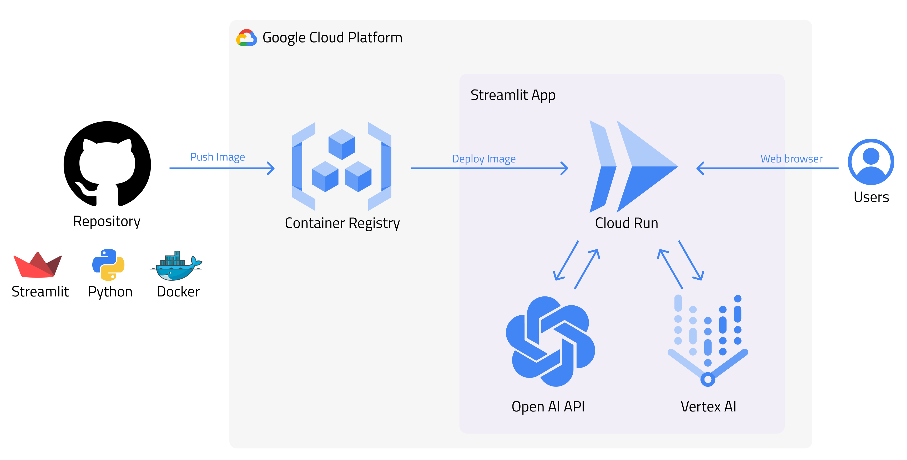

# White Brand Chatbot Assistant

## Overview
Welcome to the TVT AI Chat Streamlit project! This project aims to provide a basic chatbot using OpenAI API keys.



## Deploy localy
To get started, follow these simple steps:

1. **Create a Virtual Environment**: Start by creating a virtual environment for the project. You can use Python 3.10.12 and run the following command: ```python3 -m venv chat_venv```

2. **Activate the Virtual Environment**: Activate the virtual environment by running the following command: ```source chat_venv/bin/activate```

3. **Upgrade pip**: Make sure you have the latest version of pip installed by running: ```pip install --upgrade pip```

4. **Install Requirements**: Install the required packages by running: ```pip install -r requirements.txt```

   **Note for Windows Users**: If you encounter any installation errors, please open an issue on GitHub.

5. **Run the Application**: Start the application by running the following command in your terminal: ```streamlit run main.py```

Now you're ready to use the TVT AI Chat Streamlit project! Enjoy chatting with the chatbot.


## Configure a new assistant

1. Go to settings and modify parameters in ```settings.yaml```
   
   1. **UI**
      - disablePassword -> (change it to false before publish)
      - password
      - pagetitle
      - sidebar
        - title
        - option1
        - option2
        - option3
   2. **IA Parameters**
      - temperature
      - max_tokens
      - provider
      - instructions
   3. **Chat**
      - greeting
      - placeholder
      - bot_name
      - person_name

2. Go to `./chat_icons` and change images keeping the names.

3. Use `deploy.sh` to run in GCP Cloud Run Service

4. Use `destroy.sh` to eliminate resources in GCP.


## Coming soon
- Configuring initial prompt
- AWS deployment


## Credits
- [Streamlit](https://streamlit.io/)
- [OpenAI](https://openai.com/)
- [Google Cloud Platform](https://cloud.google.com/)

## License
This project is licensed under the MIT License - see the [LICENSE](LICENSE) file for details.
```